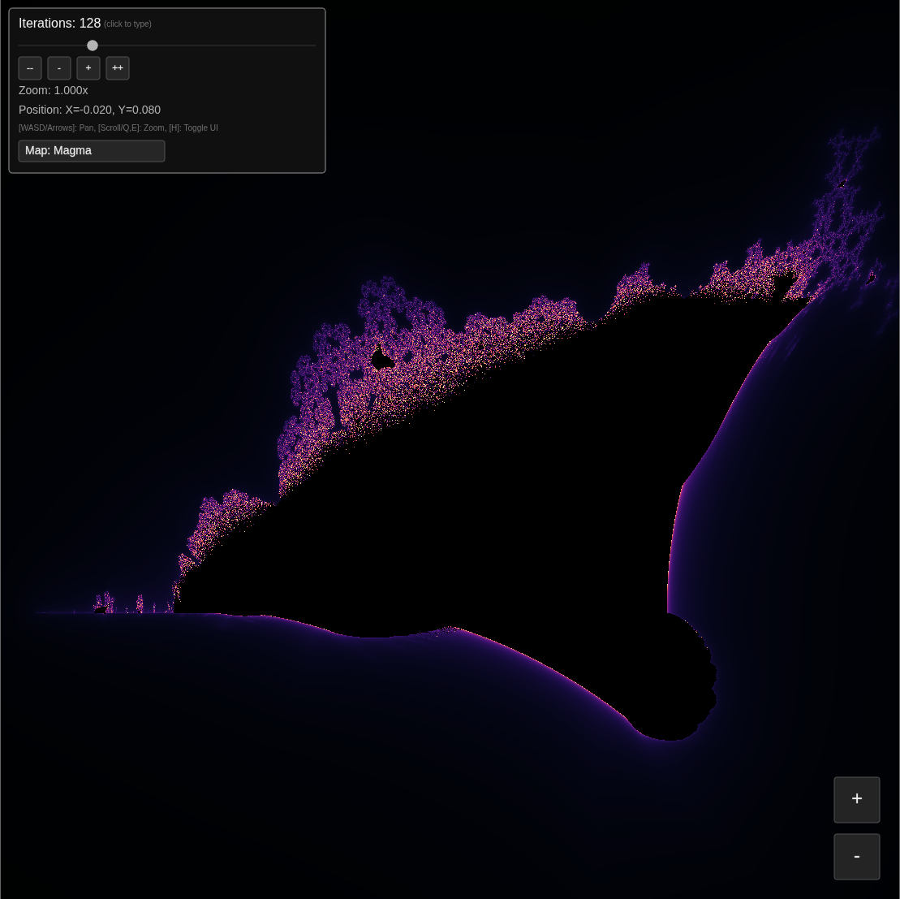

# Burning Ship Fractal

## Concept
A fractal first described by Michael Michelitsch and Otto E. Rössler, known for its resemblance to a ship on fire.
Iterates the function z = (|Re(z)| + i|Im(z)|)² + c on the complex plane.

## Controls
Interactive zooming and panning; UI sliders for iteration depth and colour mapping.

## Technology
- **Tech Stack:** Processing (Java) & p5.js

## Preview
